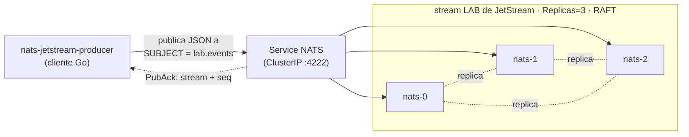
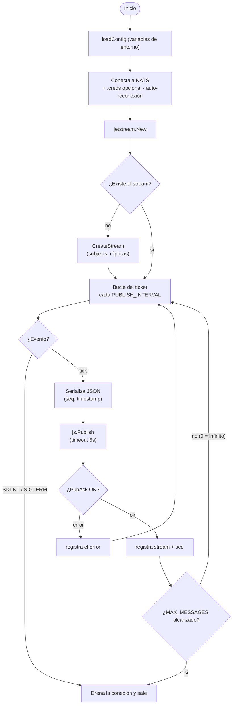

# nats-jetstream-producer

Servicio **Go** ligero que publica mensajes JSON en un *stream* de
[NATS JetStream](https://docs.nats.io/nats-concepts/jetstream) a intervalos
fijos. Forma parte de un laboratorio de NATS JetStream sobre Kubernetes, junto a
[`nats-jetstream-consumer`](https://github.com/isma-aguilera/nats-jetstream-consumer).

## Arquitectura

### Topología del servicio

Cómo encaja el producer en el cluster JetStream. Publica en un *subject*; el
Service de NATS balancea la conexión hacia un servidor y JetStream replica cada
mensaje en los 3 peers RAFT antes de confirmarlo (*PubAck*).



### Flujo del programa

El bucle de publicación, incluyendo el apagado controlado y la condición de parada
opcional `MAX_MESSAGES`.



## Notas de diseño

- **Sin secretos en el código.** La URL de conexión y las credenciales vienen de
  variables de entorno; la autenticación usa un archivo `.creds` (montado como
  *secret*), nunca un token escrito en el código.
- **Sin puertos expuestos.** Es un *cliente* NATS; no abre ningún socket de escucha.
- **Apagado controlado** ante `SIGINT`/`SIGTERM` (drena la conexión).
- **Logs estructurados en JSON** vía `log/slog`.
- Se distribuye como contenedor **distroless y no-root**.

## Configuración

| Variable           | Valor por defecto        | Descripción                                                  |
| ------------------ | ------------------------ | ------------------------------------------------------------ |
| `NATS_URL`         | `nats://localhost:4222`  | URL del servidor/cluster (`tls://` soportado).               |
| `NATS_CREDS`       | _(sin definir)_          | Ruta a un archivo `.creds` de NATS para entornos con auth.   |
| `STREAM_NAME`      | `LAB`                    | Stream en el que se publica.                                 |
| `STREAM_SUBJECTS`  | `lab.>`                  | Subjects del stream (solo si hay que crearlo).               |
| `STREAM_REPLICAS`  | `1`                      | Réplicas usadas solo al crear el stream.                     |
| `SUBJECT`          | `lab.events`             | Subject al que se publica cada mensaje.                      |
| `PUBLISH_INTERVAL` | `1s`                     | Tiempo entre publicaciones (duración Go).                    |
| `MAX_MESSAGES`     | `0`                      | Detenerse tras N mensajes; `0` = infinito.                   |

## Ejecutar en local

```bash
make tidy          # primera vez: resuelve dependencias + crea go.sum

# Alcanzar el NATS del cluster desde tu máquina:
kubectl -n nats-system port-forward svc/nats 4222:4222 &

export NATS_URL=nats://localhost:4222
make run
```

## Contenedor

```bash
make docker
docker run --rm -e NATS_URL=nats://host.docker.internal:4222 nats-jetstream-producer:latest
```

## Licencia

MIT
